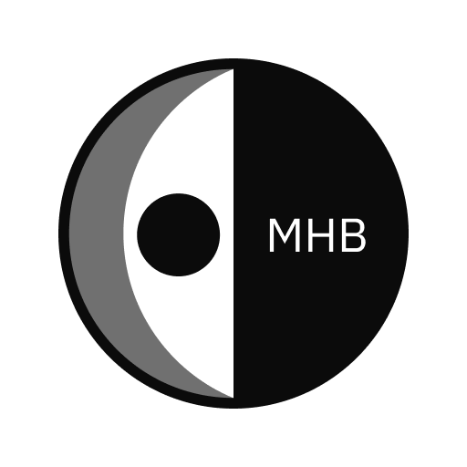
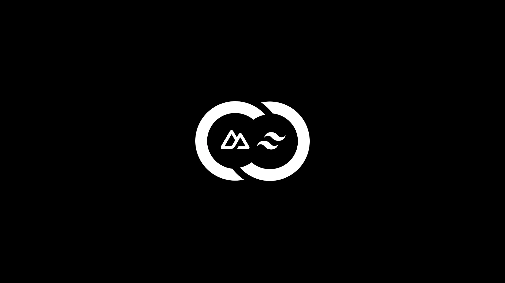

  

# Modest Human Brands

  

> Autonomous Next-Gen Media Operating System Integrating MWap, MConnect, MDoc, MCoordinate, MSync, MMedia, MDrive, MAssist

- 📦 SSR
- 🖼️ OG Tags
- 🚀 PWA
- ✋ Push Notification
- 🌙 Light/Dark Mode
- 🐋 Containerized
- 🪄 CI/CD (Github Action)
- 🎭 Authentication (OAuth 2.0)
- ⚡️ API Route Caching
- 📐 Analytics

# Avatar

size = 2(font-size) + 8

## Change the Icons and Screenshots

dir public/pwa/screenshot

## Signing Config

put upload-keystore.jks, keystore.properties into src-tauri/gen/android

add those files into the .gitignore on the same folder

## License

Published under the [MIT](https://github.com/Modest-Human-Brands/modest-human-brands/blob/main/LICENSE) license.
  

